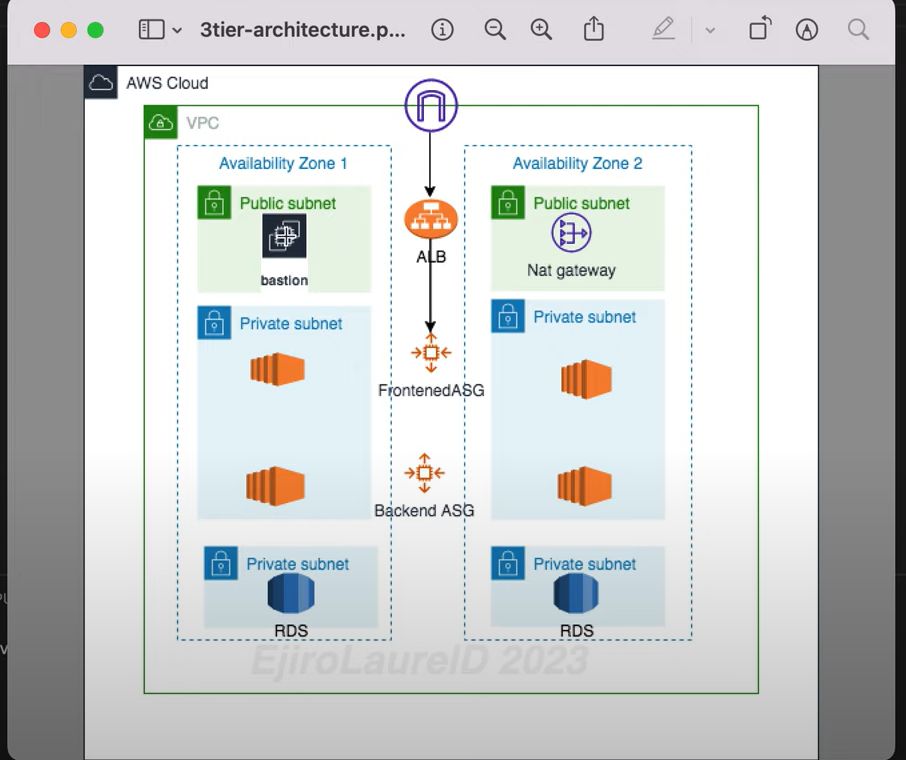

# ​​Three-Tier Architecture Deployment on AWS with Terraform

Một kiến trúc 3 tầng gồm 1 tầng Web, 1 tầng Application và 1 tầng Database trong các private subnet với Autoscaling cho tầng web và application và một bộ load balancer. Một Bastion Host và cổng Nat được cung cấp để cho phép truy cập ssh vào các máy chủ và truy cập internet.

Các mô-đun Terraform đã được sử dụng để làm quá trình dễ dàng lặp lại và có thể tái sử dụng.

Triển khai này sẽ tạo ra một cơ sở hạ tầng có khả năng mở rộng, an toàn và có sẵn cao, tách biệt các tầng khác nhau đảm bảo chúng đều giao tiếp với nhau. Kiến trúc bao gồm một Amazon Virtual Private Cloud (VPC), Elastic Load Balancer (ELB), Auto Scaling Group (ASG) và Relational Database (RDS).

- Tầng Web sẽ có một bastion host và cổng NAT được cung cấp trong public subnets. Bastion host sẽ phục vụ làm điểm truy cập vào cơ sở hạ tầng bên dưới. Cổng NAT sẽ cho phép private subnets với internet trong khi duy trì một mức độ an ninh bằng cách ẩn địa chỉ IP riêng của các máy ảo khỏi internet công cộng.

- Tầng application, tạo ra một load balancer để định hướng lưu lượng internet đến một autoscaling group trong private subnets, cùng với một autoscaling group sau cho ứng dụng backend. Chúng tôi sẽ tạo một tập lệnh để cài đặt máy chủ web apache ở phía trước và một tập lệnh để cài đặt Node.js ở phía sau.

- Tầng Database, chúng tôi sẽ có một private subnets khác chứa một cơ sở dữ liệu MySQL sẽ cuối cùng được truy cập bằng cách sử dụng Node.js.



## Prerequisites
 
Before you begin, ensure that you have the following prerequisites:
 
1. AWS account credentials (access key ID and secret access key).
2. Terraform installed on your local machine. You can download Terraform from the official website: https://www.terraform.io/downloads.html.
3. Basic knowledge of AWS services such as EC2, VPC, ELB, ASG, and RDS.
4. Familiarity with the basics of Terraform, including how to write Terraform configuration files (`.tf`).
 
## Steps
 
Follow these step-by-step instructions to deploy a three-tier architecture on AWS using Terraform:
 
### Step 1: Clone the Repository
 
1. Open a terminal or command prompt on your local machine.
2. Clone the repository containing the Terraform configuration files:
   ```
   git clone https://github.com/your-repo-url.git
   ```
3. Change into the project directory:
   ```
   cd your-repo-directory
   ```
 
### Step 2: Configure AWS Credentials
 
1. Open the AWS Management Console in your web browser.
2. Navigate to the **IAM** service.
3. Create a new IAM user or use an existing one.
4. Assign the necessary permissions to the IAM user, such as `AmazonEC2FullAccess`, `AmazonRDSFullAccess`, `AmazonVPCFullAccess`, and `ElasticLoadBalancingFullAccess`.
5. Generate an access key ID and secret access key for the IAM user.
6. Configure the AWS CLI with the IAM user credentials using the following command:
   ```
   aws configure
   ```
   Enter the access key ID and secret access key when prompted, and optionally set the default region.

### Step 3: Configure S3 bucket for state file storage
1. Sign in to your AWS account.
2. Open the Amazon S3 service.
3. Click "Create Bucket" and configure basic settings like name and region.
4. Optionally, enable features like versioning, logging, and encryption.
5. Review settings and click "Create bucket."

### Step 4: Configure Terraform Variables
 
1. Open the project directory in a text editor.
2. Locate the Terraform configuration file named `terraform.tfvars”. 
3. Modify the values of the variables according to your requirements.
   - `dbuser`: Set the username for the database.
   - `dbpassword`: Set the password for the database.
   - `db_name`: Set the name of the database.
Do not forget to gitignore your .tfvars file 
 
### Step 5: Initialize Terraform
 
1. In the terminal or command prompt, navigate to the project directory., cd to the root directory ‘terraform’
2. Run the following command to fix any syntax issue
    ```
    terraform fmt
    ```
3. Run the following command to initialize Terraform and download the required providers:
   ```
   terraform init
   ```
 
### Step 6: Review and Validate the Configuration
 
1. Run the following command to review the changes that Terraform will make:
   ```
   terraform plan
   ```
   Review the output to ensure that the planned infrastructure matches your expectations.
 
### Step 7: Deploy the Infrastructure
 
1. Run the following command to deploy the infrastructure:
   ```
   terraform apply
   ```
   Terraform will show you a summary of the changes that will be made. Type `yes` to confirm and start the deployment.
 
2. Wait for Terraform to provision the infrastructure. This process may take several minutes.
 
### Step 8: Access the Application
 
1. After the deployment is complete, Terraform will output the DNS name of the ELB.
2. Copy the DNS name and paste it into your web browser.
3. If everything is set up correctly, you should see the application running.
 
### Step 9: Destroy the Infrastructure (Optional)
 
If you want to tear down the infrastructure and remove all resources created by Terraform, you can follow these steps:
 
1. In the terminal or command prompt, navigate to the project directory.
2. Run the following command to destroy the infrastructure:
   ```
   terraform destroy
   ```
   Type `yes` to confirm the destruction.